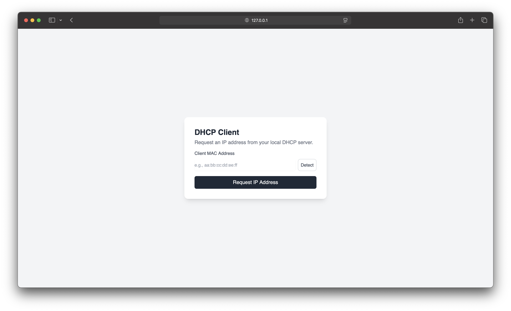
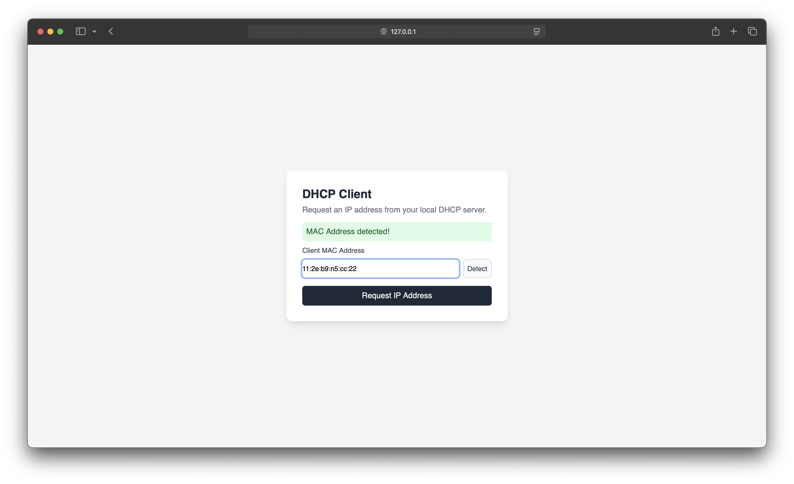
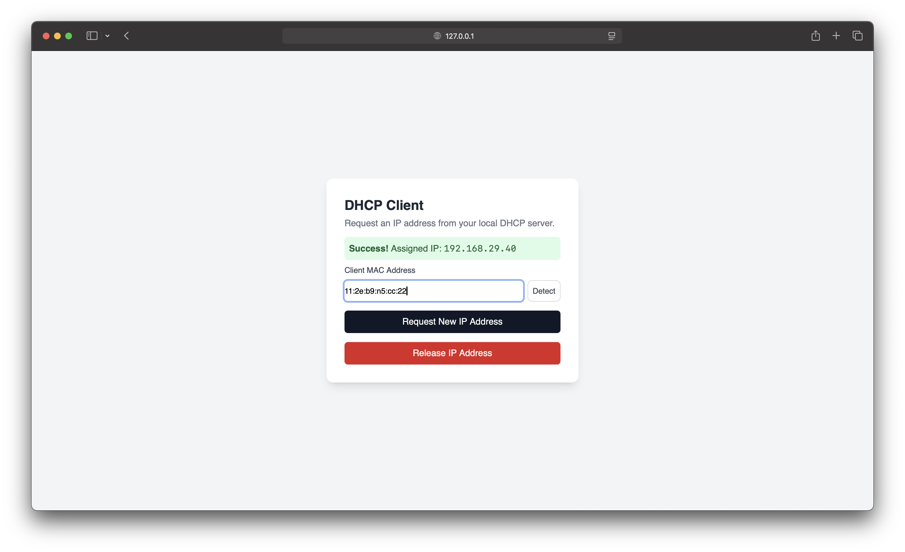
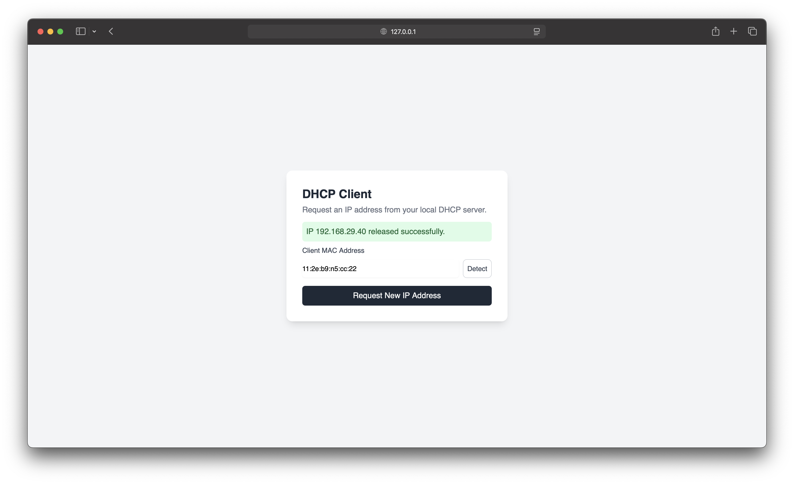

## D-O-R-A Flow for DHCP Client

1.  **`send_discover()`**:

    - This method kicks off the process.
    - It creates a `DHCPMessage` instance, which automatically generates a random transaction ID (`xid`). We save this `xid` because we need to ensure the server's responses match our original request.
    - It sets **Option 53** to `DHCPDISCOVER` to tell the server what kind of message this is.
    - It sets **Option 55** (Parameter Request List) to ask the server for extra information like the subnet mask, router (gateway), and DNS server IP.
    - Finally, it `pack()`s the message into bytes and broadcasts it to port 67. The `<broadcast>` address (`255.255.255.255`) ensures all devices on the local network see it.

2.  **`receive_offer()`**:

    - After discovering, the client listens for a `DHCPOFFER`.
    - It calls `socket.recvfrom()` which blocks until a packet arrives or the timeout (10 seconds) is hit.
    - When a packet arrives, it's `unpack()`ed into a `DHCPMessage` object.
    - **Validation is key:** It checks if the `xid` in the response matches our original `xid` and that **Option 53** is `DHCPOFFER`. This prevents us from accepting an offer meant for another client.
    - If valid, it stores the IP address the server offered (`yiaddr`) and the server's own IP (`Option 54`, Server Identifier) for the next step.

3.  **`send_request()`**:

    - Now that we have an offer we like, we must formally request it.
    - It creates a new `DHCPREQUEST` message, making sure to use the **same `xid`** as the discover/offer exchange.
    - It sets **Option 50** (Requested IP Address) to the IP we were just offered.
    - It sets **Option 54** (Server Identifier) to the IP of the server that made the offer. This is important in networks with multiple DHCP servers, as it tells all other servers "Thanks, but I'm accepting this other offer."
    - The message is then packed and broadcast.

4.  **`receive_acknowledgement()`**:

    - This is the final step. The client listens for the server's final word.
    - It waits for a packet and validates the `xid`.
    - If the message type (**Option 53**) is `DHCPACK` (Acknowledge), the lease is confirmed! We store the final IP from `yiaddr` and return `True`.
    - If the message is `DHCPNAK` (Negative Acknowledge), the server has denied our request for some reason. The process fails.

5.  **`request_ip_address()`**:

    - This is the main public method that orchestrates the entire D-O-R-A sequence by calling the other methods in the correct order. It handles the success/failure logic and provides a clean entry point to start the process.

6.  **`release_ip_address()`**:
    - This method's job is to formally tell the DHCP server that the client is finished using a specific IP address.
    - This is a "polite" action that allows the server to immediately return the IP to its pool of available addresses.

## Command line result

```console
Initializing DHCP Client...
Socket created and bound successfully to ('', 68).
[D] Sending DHCPDISCOVER (xid: 0xe1d8e3e4)...
[O] Waiting for DHCPOFFER...
[O] Received DHCPOFFER from 192.168.1.1 (192.168.1.1)
    Offered IP: 192.168.29.40

[R] Sending DHCPREQUEST for 192.168.29.40...
[A] Waiting for DHCPACK/DHCPNAK...
[A] Received DHCPACK from 192.168.1.1
    IP Address 192.168.29.40 is now leased.
    IP Acquisition Successful
    Assigned IP: 192.168.29.40
Socket closed.

Initializing DHCP Client...
Socket created and bound successfully to ('', 68).
[RELEASE] Sending DHCPRELEASE for 192.168.29.40 to 192.168.1.1...
Socket closed.
```

## Frontend






## DHCP Client Project Plan

This plan outlines the tasks required to build a functional DHCP client with a user-friendly interface.

### Phase 1: Core DHCP Logic (Backend)

The goal of this phase is to handle the fundamental DHCP protocol interactions.

- [x] **Task 1.1: Project Setup**
  - Create a new project directory.
  - Set up a Python virtual environment.
  - Install necessary libraries (e.g., `flask` for the future UI).
- [x] **Task 1.2: DHCP Message Structure (RFC 2131)**
  - Define a Python class or data structure to represent a DHCP message.
  - Include fields for `Op`, `Htype`, `Hlen`, `Xid` (Transaction ID), `CIAddr`, `YIAddr`, `SIAddr`, `GIAddr`, `CHAddr` (MAC Address), and `Options`.
- [x] **Task 1.3: DHCP Message Serialization**
  - Create a function that takes a DHCP message object (from Task 1.2) and converts it into a `bytes` object formatted for UDP transmission.
  - Pay close attention to data types, byte order (network byte order - big-endian), and field sizes.
- [x] **Task 1.4: DHCP Message Deserialization**
  - Create a function that takes a `bytes` object (received from a DHCP server) and parses it into a DHCP message object.
  - This is the reverse of serialization.
- [x] **Task 1.5: UDP Socket Communication**

  - Write the code to create a UDP socket.
  - Configure the socket to send broadcast messages (`SO_BROADCAST`).
  - Bind the socket to listen for responses on the correct port (client port 68).

- [x] **Task 1.6: Implement the D-O-R-A Flow**
  - **Discover:** Construct and serialize a `DHCPDISCOVER` message. Broadcast it using the UDP socket.
  - **Offer:** Listen for an incoming `DHCPOFFER` message from a server. Deserialize and validate it.
  - **Request:** Construct and serialize a `DHCPREQUEST` message using information from the offer. Broadcast it.
  - **Acknowledge:** Listen for a `DHCPACK` message to confirm the IP address lease.

### Phase 2: User Interface (Frontend)

The goal of this phase is to build an interface to control the client and display results.

- [x] **Task 2.1: Basic Web Server**

  - Set up a basic Flask application in a separate file.
  - Create a simple HTML template for the user interface.
  - Add a detect MAC address button in the UI

- [x] **Task 2.2: UI Controls and Display**

  - Add a "Request IP Address" button to the HTML page.
  - Create areas to display the client's status (e.g., "Discovering...", "Requesting...", "Bound"), the assigned IP address, and a log of messages.

- [x] **Task 2.3: API Endpoints**
  - Create a Flask route (e.g., `/start-dhcp`) that the frontend button can call.
  - This endpoint will trigger the DHCP logic from Phase 1.
  - Create another endpoint (e.g., `/status`) for the frontend to poll for updates.

### Phase 3: Integration and Refinement

- [x] **Task 3.1: Real-time Updates**
- [x] **Task 3.2: Handling Other Message Types**
  - Add more specific logic for handling DHCPNAK messages to provide clearer error feedback.
- [x] **Task 3.3: Error Handling & Edge Case**
  - Add more robust error handling and edge cases (e.g., what if the network cable is unplugged mid-process?).
